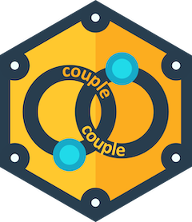

<!-- README.md is generated from README.Rmd. Please edit that file -->

```{r, include = FALSE}
knitr::opts_chunk$set(
  collapse = TRUE,
  comment = "#>",
  fig.path = "man/figures/README-",
  out.width = "100%"
)
```

# couple 

<!-- badges: start -->
[](https://lifecycle.r-lib.org/articles/stages.html#experimental)
[](https://CRAN.R-project.org/package=copulary)
[](https://app.codecov.io/gh/probaverse/couple?branch=main)
<!-- badges: end -->

**couple** provides a framework for creating and evaluating multivariate distributions, by linking one-dimensional (marginal) distributions via copulas. 

## Installation

**couple** is not yet on CRAN. You can install it from github by executing the following code in your R console:

``` r
remotes::install_github("probaverse/couple")
```

If it doesn't work, check that you have the **remotes** package installed, first. 

## Example

