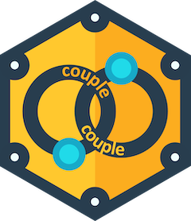

<!-- README.md is generated from README.Rmd. Please edit that file -->
<style>
p.comment {
background-color: #FEF8C3;
padding: 10px;
border: 1px solid black;
margin-left: 25px;
border-radius: 5px;
font-style: italic;
}
</style>

# couple 

<!-- badges: start -->

[](https://lifecycle.r-lib.org/articles/stages.html#experimental)
[](https://CRAN.R-project.org/package=copulary)
[](https://app.codecov.io/gh/probaverse/couple?branch=main)
[](https://github.com/probaverse/couple/actions/workflows/R-CMD-check.yaml)
<!-- badges: end -->

Complex systems often demand insight into multiple variables and their
relationships. **couple** enables you to construct realistic
multivariate distributions by combining copulas and univariate
distributions, creating a more nuanced picture of interconnected data.

<p class="comment">
<svg height="24" xmlns="http://www.w3.org/2000/svg" viewBox="0 0 24 24">
<path fill="none" stroke="currentColor" stroke-linecap="round" stroke-linejoin="round" stroke-width="1.5" d="M12 9v3.75m-9.303 3.376c-.866 1.5.217 3.374 1.948 3.374h14.71c1.73 0 2.813-1.874 1.948-3.374L13.949 3.378c-.866-1.5-3.032-1.5-3.898 0zM12 15.75h.007v.008H12z"/>
</svg>
**couple** is not available yet.
</p>

## Installation

**couple** is not yet on CRAN. You can install it from github by
executing the following code in your R console:

``` r
remotes::install_github("probaverse/couple")
```

If it doesn’t work, check that you have the **remotes** package
installed, first.

## Example
